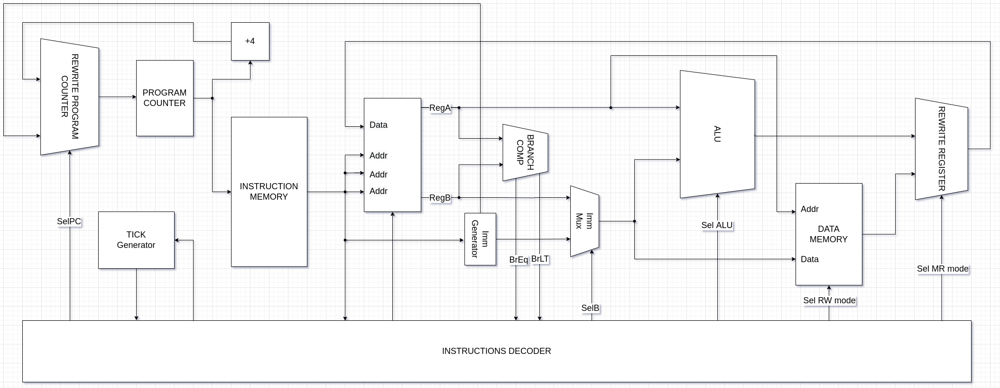

# Транслятор и модель

### Вариант ###

`asm | risc  | harv   | hw | tick  | struct  | stream | mem | prob5`

| Особенность             |     |
|-------------------------|--------|
| ЯП. Синтаксис           |  синтаксис ассемблера. Необходима поддержка label-ов |
| Архитектура             | Система команд должна быть упрощенной, в духе RISC архитектур.|
| Организация памяти      |  Гарвардская архитектура.|
| Control Unit            | hardwired. Реализуется как часть модели.|
| Точность модели         |  процессор необходимо моделировать с точностью до такта|
| Представление маш. кода |  В виде высокоуровневой структуры данных. Считается, что одна инструкция укладывается в одно машинное слово, за исключением CISC архитектур.|
| Ввод-вывод              |  Ввод-вывод осуществляется как поток токенов.|
| Ввод-вывод ISA          |  Memory-mapped|
| Алгоритм                | Каково наименьшее положительное число, которое  делится без остатка на все числа от 1 до 20?|

## Язык программирования

```bnf
<program> ::= 
        "section" " "+ "data:" <whitespace>* <data_section>?
        <whitespace> 
        "section" " "+ "text:" <whitespace>* <instruction_section>?
<data_section> ::= <data> (<whitespace> <data>)*
<data> ::= (<label_declaration>) " "* (<char_literal> | <number>) ("," (<char_literal> | <number>))*
<instruction_section> ::= <instruction> (<whitespace> <instruction>)*
<instruction> ::= (<label_declaration>)? " "* <letter>+ (" " (<address>  | (<reg> "," <address>) | (<reg> "," <reg> "," <address>)))? 
<address> ::= <number> | <label>
<reg> ::= "x" <number>
<label_declaration> ::= <label> ":"
<label> ::= <letter>+
<char_literal> ::= "'" (<letter> | <digit> | <whitespace>)+ "'"
<letter> ::= "A" | "B" | "C" | "D" | "E" | "F" | "G"
       | "H" | "I" | "J" | "K" | "L" | "M" | "N"
       | "O" | "P" | "Q" | "R" | "S" | "T" | "U"
       | "V" | "W" | "X" | "Y" | "Z" | "a" | "b"
       | "c" | "d" | "e" | "f" | "g" | "h" | "i"
       | "j" | "k" | "l" | "m" | "n" | "o" | "p"
       | "q" | "r" | "s" | "t" | "u" | "v" | "w"
       | "x" | "y" | "z"
<whitespace> ::= " " | "\n" | "\t"
<number> ::= <digit> | ( ("1" | "2" | "3" | "4" | "5" | "6" | "7" | "8" | "9") <digit>+ )
<digit> ::= "0" | "1" | "2" | "3" | "4" | "5" | "6" | "7" | "8" | "9"
```

### Поддерживаемые команды


### Организация памяти

Работа с памятью


Модель памяти процессора:

```text
s - size of memory
n - number of variables
d = size of data
i - number of instructions
     Memory
+-----------------------------------+
| 00      : variable 1              |
| 01      : variable 2              |
| 02      : array variable 3,len=l  |
|    ...                            |
| l+2 : variable 4                  |
|    ...                            |
| d-2     : variable n-1            | 
| d-1     : variable n              |
| d       : instruct 1              |
| d+1     : instruct 2              |
| d+2     : instruct 3              |
|    ...                            | 
| d+i-1   : halt (instruct i)       |
|    ...                            |
| s-1     : top of the stack        |
+-----------------------------------+
```

## Система команд Процессора

Особенности процессора:

- Машинное слово - 32 бита
- 5 регистров
- размер команд и типы аргументов фиксированы

### Регистры

Процессор в модели содержит 5 регистров

- 0 регистр -- при чтении из него всегда возвращается 0.
<!-- Необходим для некоторых операций. Например, если бы в CISC для записи в первый регистр значения из второго использовался бы `MOV X1,X2`, в RISC - `ADD X1,X2,X0` -->

#### Непосредственное значение

Для того, чтобы загружать значения непосредственно в DataPath существует функциональный элемент - Immediately Generator, который загружает непосредственно (в коде) указанные значения в АЛУ.
Команды, которые, которые используют такое значение в качестве ***последнего*** операнда, имеют в названии постфикс `I`
Например, `ADD` имеет аналог `ADDI`, а `LW` - `LWI`

### Набор инструкции

| Синтаксис |  Кол-во тактов | Комментарий                          |
|:-------|--------|:---------------------------------|
| `HALT`    |  0  | Останавливает выполнение программы|

#### Команды, работющие с памятью

Команды, отвечающие за запись и загрузку данных из памяти

| Синтаксис | Mnemonic     | операнд1 | операнд2 | Кол-во тактов |
|:-------|:-------------|---|---|------|
| `LW`    | LW        | регистр, куда будет записано значение | регистр, содержащий адрес  памяти, откуда в целевой будет записано значение             | 3                       |
| `LWI`|LWI|регистр, куда будет записано значение|непосредственно указанный адрес памяти, откуда будет извлечено значение |3 |
| `SW`    | SW    | регистр, содержащий адрес, куда будет записано занчение            | регистр, содержащий адрес памяти                         |2|
| `SWI`    | SW    | регистр, содержащий адрес, куда будет записано занчение            | Непосредственно указанный адрес памяти                         |2|

#### Команды переходов

Команды, реализующие условные переходы.
Имеют три аргумента - первый и второй операнды, участвующие в сравнении, а третий содержит абсолютный адрес перехода

| Синтаксис | Условие перехода   | Кол-во тактов |
|:-------|:-------------|---|
| `BEQ`    | операнды равны    | 4|
| `BNE`    | операнды не равны    | 4 |
| `BLT` | первый операнд меньше второго         | 4 |
| `BNL` | первый операнд меньше или равен второму         |4
| `BGT` | первый операнд больше  второго         | 4|
| `JMP`    | всегда | 3 |

#### Арифметическо-логические

Команды, реализующие арифметические операции. В качестве операндом используют 3 аргумента

| Синтаксис | Арифметическая операция | Кол-во тактов |
|:-------|:-------------|:-------|
|`ADD`|сложение |4|
|`SUB`|вычитание|4|
|`MUL`|умножене|4|
|`DIV`|целочисленное деление|4|
|`REM`|отстаток от целочисленного деления|4|

Те же операции, только в качестве третьего аргумента принимающие непосредственные значения
| Синтаксис | Арифметическая операция | Кол-во тактов |
|:-------|:-------------|:-------|
|`ADDI`|сложение|4|
|`SUBI`|вычитание|4|
|`MULI`|умножене |4|
|`DIVI`|деление|4|
|`REMI`|отстаток от целочисленного деления|4|

| Синтаксис | Условие | Кол-во тактов |
|:-------|:-------------|:-------|
|`AND`|если оба условия истинны |4|
|`OR`|если хотя бы одно из условий истинно|4|

### Кодирование инструкций

- Машинный код сериализуется в список JSON.
- Один элемент списка, одна инструкция (так как в risc размер инструкций фиксированный).
- Индекс списка - адрес инструкции. Используется для команд перехода.

Пример:

```json
[
    {
        "opcode": "ADDI",
        "args": [
            "arg1",
            "arg2",
            "arg3"
        ]
    }
]
```

где:

- `opcode` -- строка с кодом операции;
- `args` -- список аргументов (может отсутствовать (только в случае HALT));

## Транслятор

### Модель процессора

Реализовано в модуле [machine.py](./machine.py)

#### DataPath & ControlUnit



#### ControlUnit

Реализован в классе `ControlUnit`.

- Hardwired (реализовано полностью на python).
- Моделирование на уровне тактов.
- Трансляция инструкции в последовательность (0-5 тактов) сигналов: `decode_and_execute_instruction`.

Сигналы:

- `SelImm` -- сигнал загрузки *непосредственных* значений.
- `SelPC` -- сигнал для выбора типа загрузчи счетчика команд на следующую инструкцию
- `SelReg` -- сигнал для перезаписи значения в регистр регистров ()
- `SelB` -- сигнал для загрузки значения в АЛУ (RegB | Imm)
- `SelALU` -- сигнал выбора типа арифметико-логической операции в АЛУ
- `SelRW` -- сигнал для выбора режима обращения к памяти (Read|Write)
- `SelMA` -- сигнал для выбора режима перезаписи значения регистра (Memory|ALU)

Особенности работы модели:

- Для журнала состояний процессора используется стандартный модуль logging.
- Количество инструкций для моделирования ограничено hardcoded константой.
- Остановка моделирования осуществляется при помощи исключений:
  - `EOFError` -- если нет данных для чтения из порта ввода-вывода;
  - `StopIteration` -- если выполнена инструкция `halt`.
- Управление симуляцией реализовано в функции `simulate`.

## Апробация

| ФИО              | алг.  | LoC       | code инстр. | инстр. | такт. |
|------------------|-------|------------|-------------|--------|- |
| fish |cat| 10| 14 | 127  | 351    |
| sifh |hello| 5| 54 | 141  | 414    |
| fish |prob5| 109 | 208 | 14415 | 47052 |


В качестве тестов использовано два алгоритма:

1. [hello world](./programs/hello_world.lsp) - выводит `Hello, world!` в stdin.
2. [cat](./programs/cat.lsp) - программа `cat`, повторяем ввод на выводе.
3. [prob5](./programs/prob5.lsp) - problem 5

Интеграционные тесты реализованы тут: [integration_test](./integration_test.py)

CI:

``` yaml
lab3:
  stage: test
  image:
    name: python-tools
    entrypoint: [""]
  script:
    - python3-coverage run -m pytest --verbose
    - find . -type f -name "*.py" | xargs -t python3-coverage report
    - find . -type f -name "*.py" | xargs -t pycodestyle --ignore=E501
    - find . -type f -name "*.py" | xargs -t pylint

```

где:

- `python3-coverage` -- формирование отчёта об уровне покрытия исходного кода.
- `pytest` -- утилита для запуска тестов.
- `pycodestyle` -- утилита для проверки форматирования кода. `E501` (длина строк) отключено.
- `pylint` -- утилита для проверки качества кода. Некоторые правила отключены в отдельных модулях с целью упрощения кода.
- Docker image `python-tools` включает в себя все перечисленные утилиты. Его конфигурация: [Dockerfile](./Dockerfile).

Пример использования и журнал работы процессора на примере `prob5`:

```bash

> python3 translator.py programs/prob5.lsp programs/prob5.json
source LoC: 109 code instr: 208
> programs/prob5.json 

```

[programs/prob5.json](programs/prob5.json)

```python

> ./machine.py programs/prob5.json programs/inputs/input.txt

INFO:root:{ INPUT MESSAGE } [ `berkeley ~ ` ]
INFO:root:{ INPUT TOKENS  } [ 98,101,114,107,101,108,101,121,32,126,32,0 ]
DEBUG:root:{TICK: 0, PC: 1, ADDR: 0, OUT: } {[T: 1, L: 0, R: 0, IM: 2]  Regs [0 0 0 0 35] } ALU [a:0 b:0 output:0] ADDI [1 0 2] 
DEBUG:root:{TICK: 1, PC: 1, ADDR: 0, OUT: } {[T: 1, L: 0, R: 0, IM: 2]  Regs [0 0 0 0 35] } ALU [a:0 b:2 output:0] ADDI [1 0 2] 
DEBUG:root:{TICK: 2, PC: 1, ADDR: 0, OUT: } {[T: 1, L: 0, R: 0, IM: 2]  Regs [0 0 0 0 35] } ALU [a:0 b:2 output:2] ADDI [1 0 2] 
DEBUG:root:{TICK: 3, PC: 1, ADDR: 0, OUT: } {[T: 1, L: 0, R: 0, IM: 2]  Regs [0 2 0 0 35] } ALU [a:0 b:2 output:2] ADDI [1 0 2] 
DEBUG:root:{TICK: 4, PC: 2, ADDR: 0, OUT: } {[T: 2, L: 0, R: 0, IM: 20]  Regs [0 2 0 0 35] } ALU [a:0 b:2 output:2] ADDI [2 0 20] 
DEBUG:root:{TICK: 5, PC: 2, ADDR: 0, OUT: } {[T: 2, L: 0, R: 0, IM: 20]  Regs [0 2 0 0 35] } ALU [a:0 b:20 output:2] ADDI [2 0 20] 
DEBUG:root:{TICK: 6, PC: 2, ADDR: 0, OUT: } {[T: 2, L: 0, R: 0, IM: 20]  Regs [0 2 0 0 35] } ALU [a:0 b:20 output:20] ADDI [2 0 20] 
DEBUG:root:{TICK: 7, PC: 2, ADDR: 0, OUT: } {[T: 2, L: 0, R: 0, IM: 20]  Regs [0 2 20 0 35] } ALU [a:0 b:20 output:20] ADDI [2 0 20] 
DEBUG:root:{TICK: 8, PC: 3, ADDR: 0, OUT: } {[T: 2, L: 2, R: 1, IM: 20]  Regs [0 2 20 0 35] } ALU [a:0 b:20 output:20] SW [2 1] 
DEBUG:root:{TICK: 9, PC: 3, ADDR: 0, OUT: } {[T: 2, L: 2, R: 1, IM: 20]  Regs [0 2 20 0 35] } ALU [a:0 b:20 output:20] SW [2 1] 
DEBUG:root:{TICK: 10, PC: 4, ADDR: 0, OUT: } {[T: 1, L: 2, R: 1, IM: 20]  Regs [0 2 20 0 35] } ALU [a:0 b:20 output:20] LWI [1 20] 
...
DEBUG:root:{TICK: 47596, PC: 261, ADDR: 34, OUT: } {[T: 4, L: 4, R: 1, IM: 1]  Regs [0 48 170 50 34] } ALU [a:0 b:170 output:170] ADDI [4 4 1] 
DEBUG:root:{TICK: 47597, PC: 261, ADDR: 34, OUT: } {[T: 4, L: 4, R: 1, IM: 1]  Regs [0 48 170 50 34] } ALU [a:34 b:1 output:170] ADDI [4 4 1] 
DEBUG:root:{TICK: 47598, PC: 261, ADDR: 34, OUT: } {[T: 4, L: 4, R: 1, IM: 1]  Regs [0 48 170 50 34] } ALU [a:34 b:1 output:35] ADDI [4 4 1] 
DEBUG:root:{TICK: 47599, PC: 261, ADDR: 34, OUT: } {[T: 4, L: 4, R: 1, IM: 1]  Regs [0 48 170 50 35] } ALU [a:34 b:1 output:35] ADDI [4 4 1] 
DEBUG:root:{TICK: 47600, PC: 262, ADDR: 34, OUT: } {[T: 1, L: 4, R: 1, IM: 1]  Regs [0 48 170 50 35] } ALU [a:34 b:1 output:35] LW [1 4] 
DEBUG:root:{TICK: 47601, PC: 262, ADDR: 35, OUT: } {[T: 1, L: 4, R: 1, IM: 1]  Regs [0 48 170 50 35] } ALU [a:34 b:1 output:35] LW [1 4] 
DEBUG:root:{TICK: 47602, PC: 262, ADDR: 35, OUT: } {[T: 1, L: 4, R: 1, IM: 1]  Regs [0 0 170 50 35] } ALU [a:34 b:1 output:35] LW [1 4] 
DEBUG:root:{TICK: 47603, PC: 263, ADDR: 35, OUT: } {[T: 1, L: 1, R: 0, IM: 266]  Regs [0 0 170 50 35] } ALU [a:34 b:1 output:35] BEQ [1 0 
Output is `232792560`
instr_counter: 14571 ticks: 47607

```
