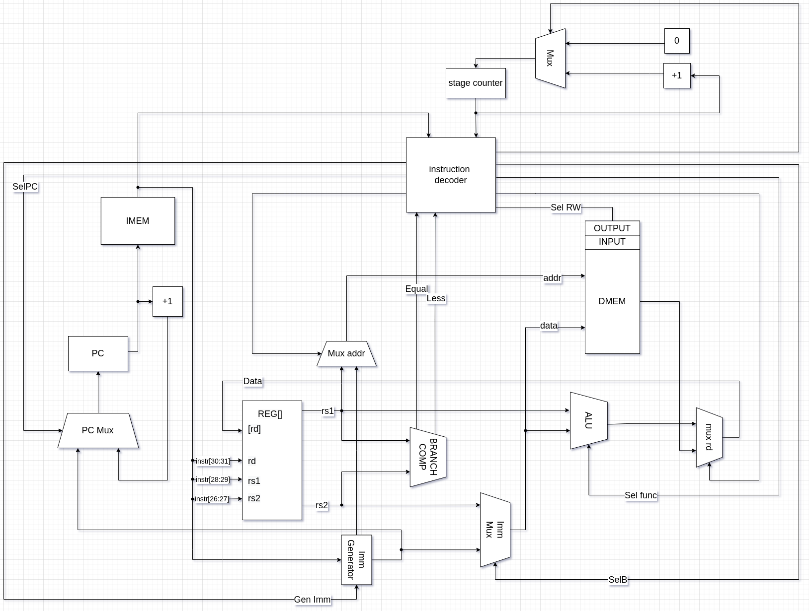

# Транслятор и модель

### Вариант ###

`asm | risc  | neum   | hw | tick  | struct  | stream | mem | prob5`

| Особенность             |     |
|-------------------------|--------|
| ЯП. Синтаксис           |  синтаксис ассемблера. Необходима поддержка label-ов |
| Архитектура             | Система команд должна быть упрощенной, в духе RISC архитектур |
| Организация памяти      |  фон Неймановская архитектура |
| Control Unit            | hardwired. Реализуется как часть модели.|
| Точность модели         |  процессор необходимо моделировать с точностью до такта|
| Представление маш. кода |  бинарное представление. При этом необходимо сделать экспорт в формате с мнемоникой команд для возможности анализа машинного кода. |
| Ввод-вывод              |  Ввод-вывод осуществляется как поток токенов |
| Ввод-вывод ISA          |  Memory-mapped|
| Алгоритм                | Каково наименьшее положительное число, которое  делится без остатка на все числа от 1 до 20?|

## Язык программирования

```bnf
<program> ::= 
        "section" " "+ "data:" <whitespace>* <data_section>?
        <whitespace> 
        "section" " "+ "text:" <whitespace>* <instruction_section>?
<data_section> ::= <data> (<whitespace> <data>)*
<data> ::= (<label_declaration>) " "* (<char_literal> | <number>) ("," (<char_literal> | <number>))*
<instruction_section> ::= <instruction> (<whitespace> <instruction>)*
<instruction> ::= (<label_declaration>)? " "* <letter>+ (" " (<address>  | (<reg> "," <address>) | (<reg> "," <reg> "," <address>)))? 
<address> ::= <number> | <label>
<reg> ::= "x" <number>
<label_declaration> ::= <label> ":"
<label> ::= <letter>+
<char_literal> ::= "'" (<letter> | <digit> | <whitespace>)+ "'"
<letter> ::= <lower_letter> | <upper_letter>
<lower_letter> ::= [a-z]
<upper_letter> ::= [A-Z]
<whitespace> ::= " " | "\n" | "\t"
<number> ::= <digit> | ( ([1-9]) <digit>+ )
<digit> ::= [0-9]
```

В программе должны быть две обязательные секции - для данных (может быть пустой) и для кода - section data: и section text: соответственно
Поддерживаются метки.
Метка - это символьное имя, обозначающее ячейку памяти, которая содержит некоторую команду или данные. Метка обязана начинаться с строчной или прописной буквы, кроме того, может содержать в своём имени цифры
Метки `STDUN` и `STDOUT` зарезервированы.

В секции данных после метки следуют значения, располагающиеся последовательно по адресам, на которые указывает метка. Поддерживаются строковые литералы.
Фактически в памяти будет массив, содержащий коды символов строки.
В секции кода метка будет содержать адрес следующей после нее инструкции

Поддерживаются однострочные комментарии, начинаются с символа #

Код выполняется последовательно.

Пример:

```nasm
section data:
hello: 'Hello, World!',0
lenght: 13

section text:
    _start:
        addi x2,x0,hello
        addi x3,x0,STDOUT
    write:
        lw x1,x2
        beq x1,x0,end
        sw x3,x1
        addi x2,x2,1
        jmp write
    end:
        halt
```

### Поддерживаемые команды

- `lw  rd,rs` - загружает из памяти по адресу rs в регистр rd
- `lwi rd,imm` - загружает из памяти по адресу imm в регистр rd
- `swi rd,imm` - записывает значение imm в память по адресу rd
- `sw rd, rs` - записывает значение регистра rs в память по адресу rd
- `add rd,rs1,rs2` - складывает rs1 и rs2 и записывает результат в регистр rd
- `sub rd,rs1,rs2` - вычитает из rs1 rs2 и записывает результат в регистр rd
- `mul rd,rs1,rs2` - умножает rs1 и rs2 и записывает результат в регистр rd
- `div rd,rs1,rs2` - делит rs1 на rs2 и записывает результат целочисленного деления в регистр rd
- `rem rd,rs1,rs2` - делит rs1 и rs2 и записывает результат остаток от деления в регистр rd
- `beq rs1,rs2,imm` - условный переход по адресу imm, если значения в регистрах rs1 == rs2
- `bne rs1,rs2,imm` - условный переход по адресу imm, если значения в регистрах rs1 != rs2
- `blt rs1,rs2,imm` - условный переход по адресу imm, если значения в регистрах rs1 < rs2
- `bgt rs1,rs2,imm` - условный переход по адресу imm, если значения в регистрах rs1 > rs2
- `bng rs1,rs2,imm` - условный переход по адресу imm, если значения в регистрах rs1 <= rs2
- `bnl rs1,rs2,imm` - условный переход по адресу imm, если значения в регистрах rs1 >= rs2
- `jmp imm` - безусловный переход по адресу imm
- `halt` - завершение программы

### Организация памяти

Работа с памятью

Модель памяти процессора:

```text
s - size of memory
n - number of variables
d = size of data
i - number of instructions
     Memory
+-----------------------------------+
| 00      : variable 1              |
| 01      : variable 2              |
| 02      : array variable 3,len=l  |
|    ...                            |
| l+2 : variable 4                  |
|    ...                            |
| d-2     : variable n-1            | 
| d-1     : variable n              |
| d       : instruct 1              |
| d+1     : instruct 2              |
| d+2     : instruct 3              |
|    ...                            | 
| d+i-1   : halt (instruct i)       |
|    ...                            |
| s-1     : top of the stack        |
+-----------------------------------+
```

## Система команд Процессора

Особенности процессора:

- Машинное слово - 32 бита
- 5 регистров
- размер команд и типы аргументов фиксированы

Модель памяти процессора:

- Память для команд и данных общая.
- Машинное слово -- 32 бита, знаковое. Линейное адресное пространство. 

### Регистры

Процессор в модели содержит 5 регистров

- 0 регистр -- при чтении из него всегда возвращается 0.
<!-- Необходим для некоторых операций. Например, если бы в CISC для записи в первый регистр значения из второго использовался бы `MOV X1,X2`, в RISC - `ADD X1,X2,X0` -->

#### Непосредственное значение

Для того, чтобы загружать значения непосредственно в DataPath существует функциональный элемент - Immediately Generator, который загружает непосредственно (в коде) указанные значения в АЛУ.
Команды, которые, которые используют такое значение в качестве ***последнего*** операнда, имеют в названии постфикс `I`

### Кодирование инструкций

Инструкции представляют собой 32-битные машинные слова в следующем формате

- rd - register destination - регистр, куда будет записано значение после выполнения инструкции
- rs1 и rs2 - register source 1,2 - регистры, значения которых будут использоваться для вычисления результата операции
- imm - immediate непосредственное значение
- opcode - номер инструкции

```ascii


  31        29   28   26   25      23   22       5   4    0    Bits
+-----------------------------------------------------------+
|      rd      |   rs1   |    rs2     |            | opcode | Register type
+-----------------------------------------------------------+
|      rd      |   rs1   | imm[20:18] | imm[17:0]  | opcode | Immediate type
+-----------------------------------------------------------+
|  imm[20:18]  |   rs1   |    rs2     | imm[17:0]  | opcode | Branch type
+-----------------------------------------------------------+
|                       imm                        | opcode | Jump type
+-----------------------------------------------------------+

```

<!-- размер адреса регистров 3 бита потому что в процессоре используется всего 5 регистров
размер opcode - 5 бит чтобы закодировать 23 инструкции -->

### Набор инструкции

| Синтаксис |  Кол-во тактов | Комментарий                          |
|:-------|--------|:---------------------------------|
| `HALT`    |  0  | Останавливает выполнение программы|

#### Команды, работющие с памятью

Команды, отвечающие за запись и загрузку данных из памяти

| Синтаксис | операнд1 | операнд2 | Кол-во тактов | Тип инструкции* |
|:-------|:-------------|------|------|----|
| `LW`    |  регистр, куда будет записано значение | регистр, содержащий адрес  памяти, откуда в целевой будет записано значение   | 3 |   Register                    |
| `LWI`|регистр, куда будет записано значение|непосредственно указанный адрес памяти, откуда будет извлечено значение |3 | Immediate|
| `SW`    |  регистр, содержащий адрес, куда будет записано занчение            | регистр, содержащий адрес  памяти                         |2| Register|
| `SWI`    |  регистр, содержащий адрес, куда будет записано занчение            | Непосредственно указанный адрес памяти                         |2| Immediate|

#### Команды переходов

Команды, реализующие условные переходы. Принаджежат* к типу Branch-инструкций.
Имеют три аргумента - первый и второй операнды, участвующие в сравнении, а третий содержит абсолютный адрес перехода

| Синтаксис | Условие перехода   | Кол-во тактов |
|:-------|:-------------|---|
| `BEQ`    | операнды равны    | 3|
| `BNE`    | операнды не равны    | 3 |
| `BLT` | первый операнд меньше второго         |3 |
| `BNL` | первый операнд меньше или равен второму         |3
| `BGT` | первый операнд больше  второго         | 3|
| `JMP`    | всегда | 2 |

\*кроме JUMP

#### Арифметическо-логические

Команды, реализующие арифметические операции. В качестве операндом используют 3 аргумента.
Принаджежат к типу Register-инструкций.

| Синтаксис | Арифметическая операция | Кол-во тактов |
|:-------|:-------------|:-------|
|`ADD`|сложение |3|
|`SUB`|вычитание|3|
|`MUL`|умножене|3|
|`DIV`|целочисленное деление|3|
|`REM`|отстаток от целочисленного деления|3|

Те же операции, только в качестве третьего аргумента принимающие непосредственные значения.
Принаджежат к типу Immediate-инструкций.

| Синтаксис | Арифметическая операция | Кол-во тактов |
|:-------|:-------------|:-------|
|`ADDI`|сложение|3|
|`SUBI`|вычитание|3|
|`MULI`|умножене |3|
|`DIVI`|деление|3|
|`REMI`|отстаток от целочисленного деления|3|

#### Struct

Так же для

- Машинный код сериализуется в список JSON.
- Один элемент списка, одна инструкция (так как в risc размер инструкций фиксированный).
- Индекс списка - адрес инструкции. Используется для команд перехода.

Пример:

```json
[
    {
        "opcode": "ADD",
        "args": [
            "arg1",
            "arg2",
            "arg3"
        ]
    }
]
```

где:

- `opcode` -- строка с кодом операции;
- `args` -- список аргументов (может отсутствовать (только в случае HALT));

## Транслятор

### Модель процессора

Реализовано в модуле [machine.py](./machine.py)

#### DataPath & ControlUnit



#### ControlUnit

Реализован в классе `ControlUnit`.

- Hardwired (реализовано полностью на python).
- Моделирование на уровне тактов.
- Трансляция инструкции в последовательность (0-5 тактов) сигналов: `decode_and_execute_instruction`.

<!-- Сигналы:

- `SelImm` -- сигнал загрузки *непосредственных* значений.
- `SelPC` -- сигнал для выбора типа загрузчи счетчика команд на следующую инструкцию
- `SelReg` -- сигнал для перезаписи значения в регистр регистров ()
- `SelB` -- сигнал для загрузки значения в АЛУ (RegB | Imm)
- `SelALU` -- сигнал выбора типа арифметико-логической операции в АЛУ
- `SelRW` -- сигнал для выбора режима обращения к памяти (Read|Write)
- `SelMA` -- сигнал для выбора режима перезаписи значения регистра (Memory|ALU) -->

Особенности работы модели:

- Для журнала состояний процессора используется стандартный модуль logging.
- Количество инструкций для моделирования ограничено hardcoded константой.
- Остановка моделирования осуществляется при помощи исключений:
  - `EOFError` -- если нет данных для чтения из порта ввода-вывода;
  - `StopIteration` -- если выполнена инструкция `halt`.
- Управление симуляцией реализовано в функции `simulate`.

## Апробация

| ФИО              | алг.  | LoC       | code байт|code инстр. | инстр. | такт. |
|------------------|-------|---------|---------|---------|--------|------|
| Алина Сагайдак |cat| 46| 46 | 188  | 210     | 509     |
| Алина Сагайдак |hello| 33| 23 | 96  | 69    | 169    |
| Алина Сагайдак |prob5| 242 | 112 | 452 | 3777 | 10399|

В качестве тестов использовано два алгоритма:

1. [hello world](./programs/hello_world.lsp) - выводит `Hello, world!` в stdin.
2. [cat](./programs/cat.lsp) - программа `cat`, повторяем ввод на выводе.
3. [prob5](./programs/prob5.lsp) - problem 5

Интеграционные тесты реализованы тут: [integration_test](./integration_test.py)

CI:

``` yaml
lab3:
  stage: test
  image:
    name: python-tools
    entrypoint: [""]
  script:
    - python3-coverage run -m pytest --verbose
    - find . -type f -name "*.py" | xargs -t python3-coverage report
    - find . -type f -name "*.py" | xargs -t pycodestyle --ignore=E501,W291
    - find . -type f -name "*.py" | xargs -t pylint

```

где:

- `python3-coverage` -- формирование отчёта об уровне покрытия исходного кода.
- `pytest` -- утилита для запуска тестов.
- `pycodestyle` -- утилита для проверки форматирования кода. `E501` (длина строк) и `W291` отключены.
- `pylint` -- утилита для проверки качества кода. Некоторые правила отключены в отдельных модулях с целью упрощения кода.
- Docker image `python-tools` включает в себя все перечисленные утилиты. Его конфигурация: [Dockerfile](./Dockerfile).

Пример использования и журнал работы процессора на примере `prob5`:

```bash
> python3 translator.py programs/prob5.json programs/prob5.bin
source LoC: 242 code instr: 112 bytes: 452

```

[prob5.json](programs/prob5.bin)
[prob5.bin](programs/prob5.bin)

```python

> ./machine.py programs/prob5.bin programs/input.txt

Output is `232792560`
instr_counter: 3777 ticks: 10399

INFO:root:{ INPUT TOKENS  } [ 71,111,111,100,32,110,101,119,115,44,32,101,118,101,114,121,111,110,101,33,0 ]
DEBUG:root:{TICK: 0, PC: 25, ADDR: 0, OUT: } {[RD: 2, RS1: 0, RS2: 0, IMM: 21]  Reg Data [0 0 0 0 198] } ALU [a:0 b:0 output:0] ADDI [2 0 0 21] 
DEBUG:root:{TICK: 1, PC: 25, ADDR: 0, OUT: } {[RD: 2, RS1: 0, RS2: 0, IMM: 21]  Reg Data [0 0 0 0 198] } ALU [a:0 b:21 output:21] ADDI [2 0 0 21] 
DEBUG:root:{TICK: 2, PC: 25, ADDR: 0, OUT: } {[RD: 2, RS1: 0, RS2: 0, IMM: 21]  Reg Data [0 0 21 0 198] } ALU [a:0 b:21 output:21] ADDI [2 0 0 21] 
DEBUG:root:{TICK: 3, PC: 26, ADDR: 0, OUT: } {[RD: 1, RS1: 0, RS2: 0, IMM: 19]  Reg Data [0 0 21 0 198] } ALU [a:0 b:21 output:21] LWI [1 0 0 19] 
DEBUG:root:{TICK: 4, PC: 26, ADDR: 19, OUT: } {[RD: 1, RS1: 0, RS2: 0, IMM: 19]  Reg Data [0 0 21 0 198] } ALU [a:0 b:21 output:21] LWI [1 0 0 19] 
DEBUG:root:{TICK: 5, PC: 26, ADDR: 19, OUT: } {[RD: 1, RS1: 0, RS2: 0, IMM: 19]  Reg Data [0 2 21 0 198] } ALU [a:0 b:21 output:21] LWI [1 0 0 19] 
DEBUG:root:{TICK: 6, PC: 27, ADDR: 19, OUT: } {[RD: 0, RS1: 1, RS2: 2, IMM: 72]  Reg Data [0 2 21 0 198] } ALU [a:0 b:21 output:21] BNL [0 1 2 72] 
DEBUG:root:{TICK: 7, PC: 27, ADDR: 19, OUT: } {[RD: 0, RS1: 1, RS2: 2, IMM: 72]  Reg Data [0 2 21 0 198] } ALU [a:0 b:21 output:21] BNL [0 1 2 72] 
DEBUG:root:{TICK: 8, PC: 28, ADDR: 19, OUT: } {[RD: 1, RS1: 0, RS2: 0, IMM: 19]  Reg Data [0 2 21 0 198] } ALU [a:0 b:21 output:21] LWI [1 0 0 19] 
DEBUG:root:{TICK: 9, PC: 28, ADDR: 19, OUT: } {[RD: 1, RS1: 0, RS2: 0, IMM: 19]  Reg Data [0 2 21 0 198] } ALU [a:0 b:21 output:21] LWI [1 0 0 19] 
DEBUG:root:{TICK: 10, PC: 28, ADDR: 19, OUT: } {[RD: 1, RS1: 0, RS2: 0, IMM: 19]  Reg Data [0 2 21 0 198] } ALU [a:0 b:21 output:21] LWI [1 0 0 19] 
DEBUG:root:{TICK: 11, PC: 29, ADDR: 19, OUT: } {[RD: 2, RS1: 0, RS2: 0, IMM: 20]  Reg Data [0 2 21 0 198] } ALU [a:0 b:21 output:21] ADDI [2 0 0 20] 
DEBUG:root:{TICK: 12, PC: 29, ADDR: 19, OUT: } {[RD: 2, RS1: 0, RS2: 0, IMM: 20]  Reg Data [0 2 21 0 198] } ALU [a:0 b:20 output:20] ADDI [2 0 0 20] 
DEBUG:root:{TICK: 13, PC: 29, ADDR: 19, OUT: } {[RD: 2, RS1: 0, RS2: 0, IMM: 20]  Reg Data [0 2 20 0 198] } ALU [a:0 b:20 output:20] ADDI [2 0 0 20] 
DEBUG:root:{TICK: 14, PC: 30, ADDR: 19, OUT: } {[RD: 0, RS1: 2, RS2: 1, IMM: 0]  Reg Data [0 2 20 0 198] } ALU [a:0 b:20 output:20] SW [0 2 1 0] 
DEBUG:root:{TICK: 15, PC: 30, ADDR: 19, OUT: } {[RD: 0, RS1: 2, RS2: 1, IMM: 0]  Reg Data [0 2 20 0 198] } ALU [a:0 b:20 output:20] SW [0 2 1 0] 

...

DEBUG:root:{TICK: 10387, PC: 110, ADDR: 197, OUT: } {[RD: 4, RS1: 4, RS2: 0, IMM: 1]  Reg Data [0 48 0 969 197] } ALU [a:196 b:1 output:197] ADDI [4 4 0 1] 
DEBUG:root:{TICK: 10388, PC: 110, ADDR: 197, OUT: } {[RD: 4, RS1: 4, RS2: 0, IMM: 1]  Reg Data [0 48 0 969 197] } ALU [a:197 b:1 output:198] ADDI [4 4 0 1] 
DEBUG:root:{TICK: 10389, PC: 110, ADDR: 197, OUT: } {[RD: 4, RS1: 4, RS2: 0, IMM: 1]  Reg Data [0 48 0 969 198] } ALU [a:197 b:1 output:198] ADDI [4 4 0 1] 
DEBUG:root:{TICK: 10390, PC: 111, ADDR: 197, OUT: } {[RD: 0, RS1: 0, RS2: 0, IMM: 106]  Reg Data [0 48 0 969 198] } ALU [a:197 b:1 output:198] JMP [0 0 0 106] 
DEBUG:root:{TICK: 10391, PC: 106, ADDR: 197, OUT: } {[RD: 0, RS1: 0, RS2: 0, IMM: 106]  Reg Data [0 48 0 969 198] } ALU [a:197 b:1 output:198] JMP [0 0 0 106] 
DEBUG:root:{TICK: 10392, PC: 107, ADDR: 197, OUT: } {[RD: 1, RS1: 4, RS2: 0, IMM: 0]  Reg Data [0 48 0 969 198] } ALU [a:197 b:1 output:198] LW [1 4 0 0] 
DEBUG:root:{TICK: 10393, PC: 107, ADDR: 198, OUT: } {[RD: 1, RS1: 4, RS2: 0, IMM: 0]  Reg Data [0 48 0 969 198] } ALU [a:197 b:1 output:198] LW [1 4 0 0] 
DEBUG:root:{TICK: 10394, PC: 107, ADDR: 198, OUT: } {[RD: 1, RS1: 4, RS2: 0, IMM: 0]  Reg Data [0 0 0 969 198] } ALU [a:197 b:1 output:198] LW [1 4 0 0] 
DEBUG:root:{TICK: 10395, PC: 108, ADDR: 198, OUT: } {[RD: 0, RS1: 1, RS2: 0, IMM: 111]  Reg Data [0 0 0 969 198] } ALU [a:197 b:1 output:198] BEQ [0 1 0 111] 
DEBUG:root:{TICK: 10396, PC: 108, ADDR: 198, OUT: } {[RD: 0, RS1: 1, RS2: 0, IMM: 111]  Reg Data [0 0 0 969 198] } ALU [a:197 b:1 output:198] BEQ [0 1 0 111] 
DEBUG:root:{TICK: 10397, PC: 111, ADDR: 198, OUT: } {[RD: 0, RS1: 1, RS2: 0, IMM: 111]  Reg Data [0 0 0 969 198] } ALU [a:197 b:1 output:198] BEQ [0 1 0 111] 
DEBUG:root:{TICK: 10398, PC: 112, ADDR: 198, OUT: } {[RD: 0, RS1: 0, RS2: 0, IMM: 0]  Reg Data [0 0 0 969 198] } ALU [a:197 b:1 output:198] HALT [0 0 0 0] 
INFO:root:Memory map is
(  198)        [0011000110]  -> [00000000000000000000000000000000] = (         0) ~ HALT 0              
(  197)        [0011000101]  -> [00000000000000000000000000110000] = (        48) ~ DIV 0, 0, 0         
(  196)        [0011000100]  -> [00000000000000000000000000110110] = (        54) ~ REMI 0, 0, 1        
(  195)        [0011000011]  -> [00000000000000000000000000110101] = (        53) ~ DIVI 0, 0, 1        
(  194)        [0011000010]  -> [00000000000000000000000000110010] = (        50) ~ ADDI 0, 0, 1        
(  193)        [0011000001]  -> [00000000000000000000000000111001] = (        57)
(  192)        [0011000000]  -> [00000000000000000000000000110111] = (        55)
(  191)        [0010111111]  -> [00000000000000000000000000110010] = (        50) ~ ADDI 0, 0, 1        
(  190)        [0010111110]  -> [00000000000000000000000000110011] = (        51) ~ MULI 0, 0, 1        
(  189)        [0010111101]  -> [00000000000000000000000000110010] = (        50) ~ ADDI 0, 0, 1        
(  188)        [0010111100]  -> [00000000000000000000000000000000] = (         0) ~ HALT 0              
(  187)        [0010111011]  -> [00000000000000000000000000000000] = (         0) ~ HALT 0              
(  186)        [0010111010]  -> [00000000000000000000000000000000] = (         0) ~ HALT 0              

...

(   52)        [0000110100]  -> [01001001100000000000000000010000] = (1233125392) ~ DIV 2, 2, 3         
(   51)        [0000110011]  -> [01100000000000000000001010100011] = (1610613411) ~ LWI 3, 0, 21        
(   50)        [0000110010]  -> [01000000000000000000001010000011] = (1073742467) ~ LWI 2, 0, 20        
(   49)        [0000110001]  -> [00100000000000000000001010010010] = ( 536871570) ~ ADDI 1, 0, 20       
(   48)        [0000110000]  -> [00001100000000000000011011001000] = ( 201328328) ~ BNE 3, 0, 54        
(   47)        [0000101111]  -> [01100101000000000000000000010001] = (1694498833) ~ REM 3, 1, 2         
(   46)        [0000101110]  -> [01000000000000000000001010100011] = (1073742499) ~ LWI 2, 0, 21        
(   45)        [0000101101]  -> [00100000000000000000001010000011] = ( 536871555) ~ LWI 1, 0, 20        
(   44)        [0000101100]  -> [00000101000000000000000000000010] = (  83886082) ~ SW 0, 1, 2          
(   43)        [0000101011]  -> [01001000000000000000000000000001] = (1207959553) ~ LW 2, 2, 0          
(   42)        [0000101010]  -> [01001000000000000000000000010010] = (1207959570) ~ ADDI 2, 2, 0        
(   41)        [0000101001]  -> [01000000000000000000001011000011] = (1073742531) ~ LWI 2, 0, 22        
(   40)        [0000101000]  -> [00100000000000000000001010110010] = ( 536871602) ~ ADDI 1, 0, 21       
(   39)        [0000100111]  -> [00001000000000000000011101100111] = ( 134219623) ~ BEQ 2, 0, 59        
(   38)        [0000100110]  -> [01000100000000000000000000000001] = (1140850689) ~ LW 2, 1, 0          
(   37)        [0000100101]  -> [00100101000000000000000000001101] = ( 620757005) ~ ADD 1, 1, 2         
(   36)        [0000100100]  -> [01000000000000000000000000010010] = (1073741842) ~ ADDI 2, 0, 0        
(   35)        [0000100011]  -> [00100000000000000000001011000011] = ( 536871619) ~ LWI 1, 0, 22        
(   34)        [0000100010]  -> [00000101000000000000011101101011] = (  83887979) ~ BNL 1, 2, 59        

...

(   10)        [0000001010]  -> [00000000000000000000000000010001] = (        17) ~ REM 0, 0, 0         
(    9)        [0000001001]  -> [00000000000000000000000000000010] = (         2) ~ SW 0, 0, 0          
(    8)        [0000001000]  -> [00000000000000000000000000001101] = (        13) ~ ADD 0, 0, 0         
(    7)        [0000000111]  -> [00000000000000000000000000001011] = (        11) ~ BNL 0, 0, 0         
(    6)        [0000000110]  -> [00000000000000000000000000000011] = (         3) ~ LWI 0, 0, 0         
(    5)        [0000000101]  -> [00000000000000000000000000000010] = (         2) ~ SW 0, 0, 0          
(    4)        [0000000100]  -> [00000000000000000000000000000111] = (         7) ~ BEQ 0, 0, 0         
(    3)        [0000000011]  -> [00000000000000000000000000000101] = (         5) ~ JMP 0               
(    2)        [0000000010]  -> [00000000000000000000000000000010] = (         2) ~ SW 0, 0, 0          
(    1)        [0000000001]  -> [00000000000000000000000000000011] = (         3) ~ LWI 0, 0, 0         
(    0)        [0000000000]  -> [00000000000000000000000000000010] = (         2) ~ SW 0, 0, 0 

```
